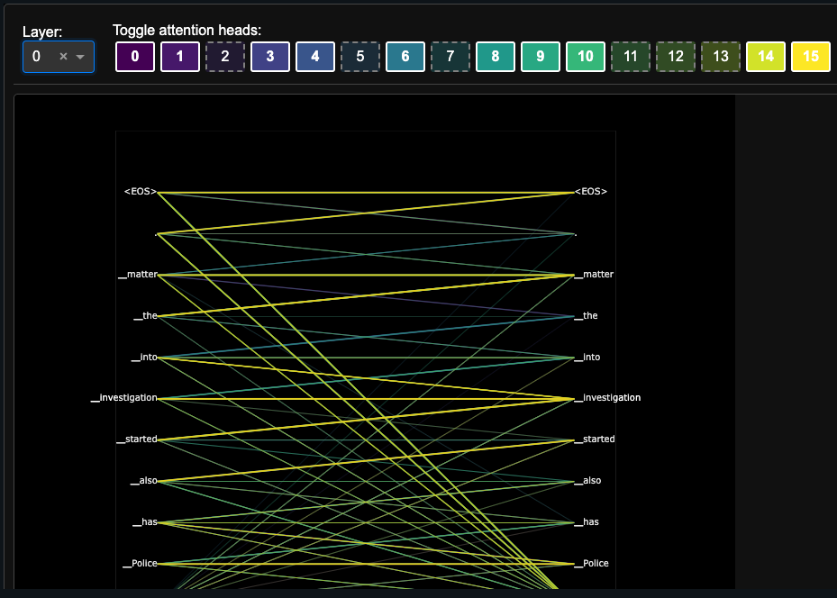
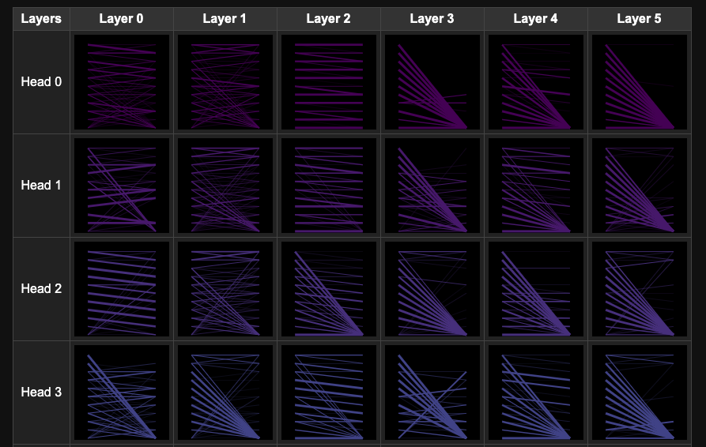
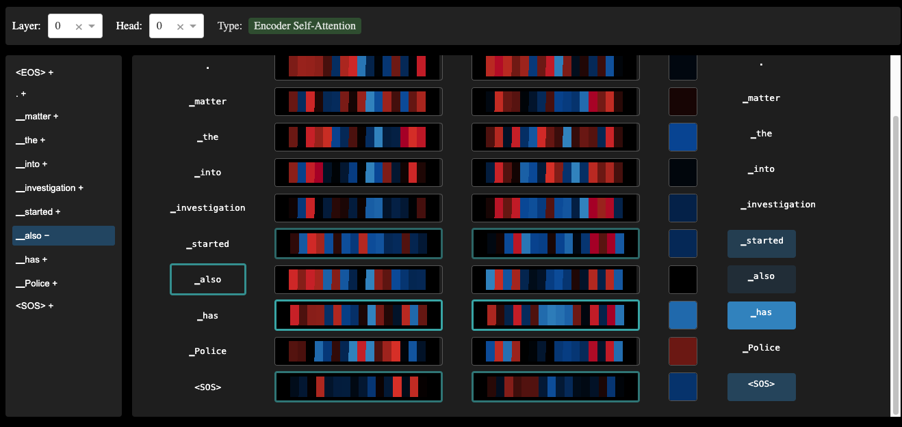

# Deep Learning from Scratch

This repository contains implementations of deep learning algorithms and concepts from scratch, without relying on high-level frameworks like PyTorch or TensorFlow. The primary focus is on machine translation architectures for English-to-Hindi sentence conversion.

## Contents

### 1. Introduction
Overview of deep learning concepts and the repository's educational purpose of understanding neural networks by building everything from the ground up.

### 2. Implementations

#### Basic Neural Networks
Implementations of feedforward neural networks with complete mathematical derivations of matrix backpropagation equations. Includes forward propagation, backpropagation derivation, and vectorised implementations. This is found inside here [here](./notebooks/nn.ipynb).

#### Byte Pair Encoding (BPE)
Complete tokenidation system for English-Hindi translation:
- Subword tokenidation handling out-of-vocabulary words
- Language-agnostic design for both English and Devanagari script
- Configurable vocabulary sizes (8K, 16K, 32K tokens)
- Special token handling for `<bos>`, `<eos>`, `<pad>`, and `<unk>`

Core implementation includes iterative merging of frequent character pairs, Unicode normalisation for Devanagari characters, and bidirectional encoding/decoding pipelines.
Due to the speed of implementation, I did the BPE algorithm as an exercise in understanding before switching over to the `sentencepiece` implementation.

#### Ablation Studies Pipeline
Systematic framework for analysing model components:
- **Automated testing**: Systematic removal/modification of model heads.
- **Performance tracking**: Comprehensive metrics logging and comparison

This file is found [here](./utils/ablation_studies.py).

### 3. Papers Implemented

- **[Attention Is All You Need](./papers/attention_is_all_you_need/analysis.ipynb)**: Complete Transformer implementation with multi-head attention, positional encoding, and layer normalisation. [[Paper]](https://arxiv.org/abs/1706.03762)

- **[MQA, GQA](./papers/attention_is_all_you_need/VanillaAttentionHead.py)**: Multi-Query Attention and Grouped Query Attention for improved efficiency. [[MQA Paper]](https://arxiv.org/abs/1911.02150) [[GQA Paper]](https://arxiv.org/abs/2305.13245)

- **[Sparse Attention with Big Bird](./papers/big_bird_attention/analysis.ipynb)**: Efficient sparse attention combining global, random, and window attention patterns. [[Paper]](https://arxiv.org/abs/2007.14062)

- **[WIP - Performers FAVOR+ Linear Attention](./papers/rethinking_attention_with_performers/analysis.ipynb)**: Linear complexity attention using kernel approximation methods. [[Paper]](https://arxiv.org/abs/2009.14794)

- **[WIP - RoPE (Rotary Position Embedding)](./papers/RoPE/analysis.ipynb)**: Rotary position embeddings for improved positional understanding. [[Paper]](https://arxiv.org/abs/2104.09864)

### 4. Custom Attention Visualisation Library

Developed a custom attention visualisation library inspired by **BertViz** with the following features:

1. **Interactive exploration**: Real-time attention head and layer analysis
2. **Comparative analysis**: Side-by-side attention pattern comparison across different inputs
3. **Multi-level visualisation**: Head-level, layer-level, and global attention patterns

**Screenshots:**

### 6. Requirements

- Python 3.11+
- NumPy
- Matplotlib
- PyYAML
- tqdm
- Jupyter

---
Happy coding!
